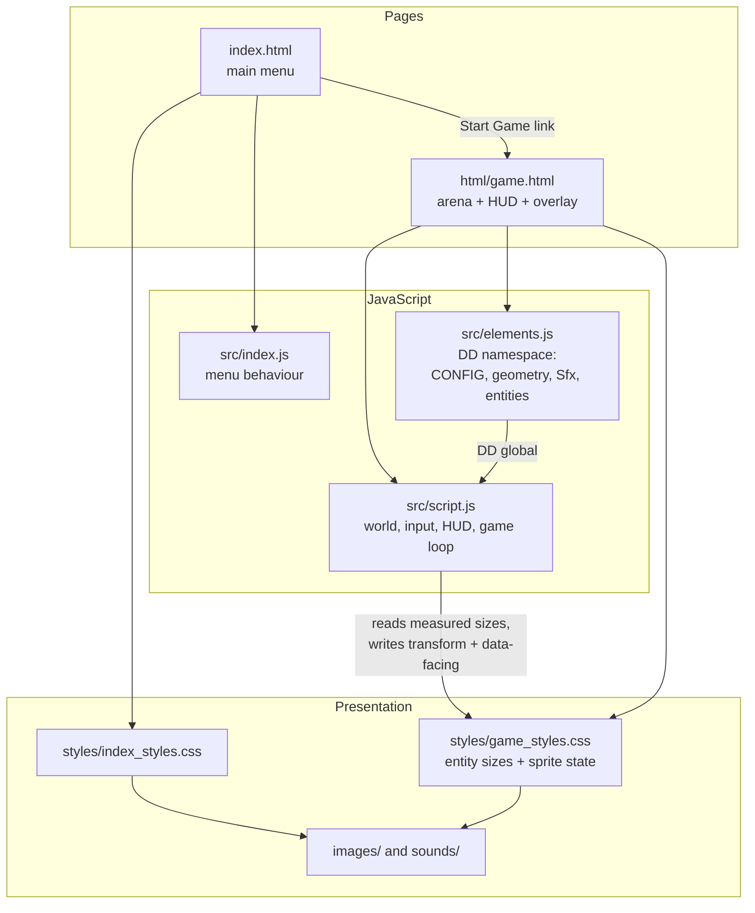
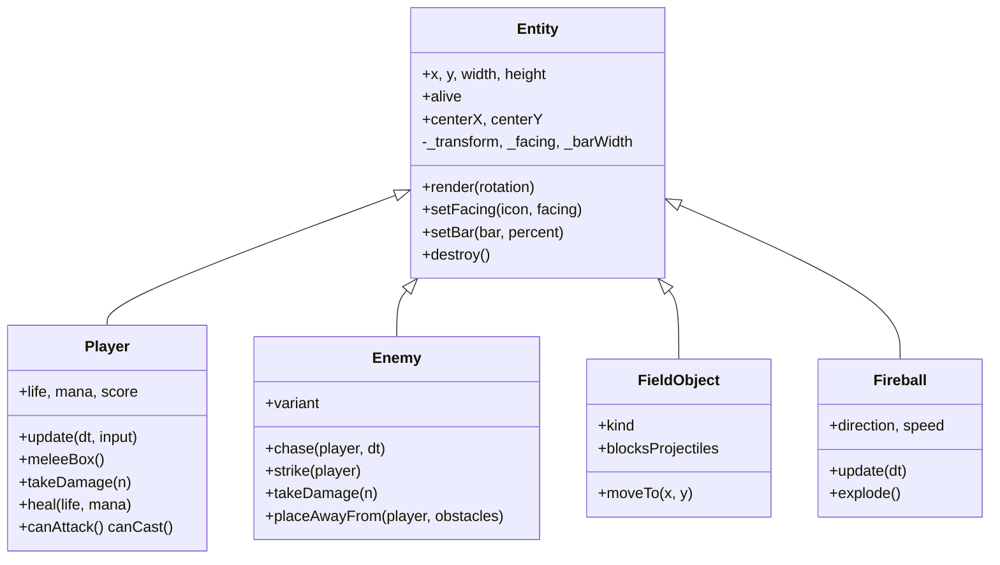
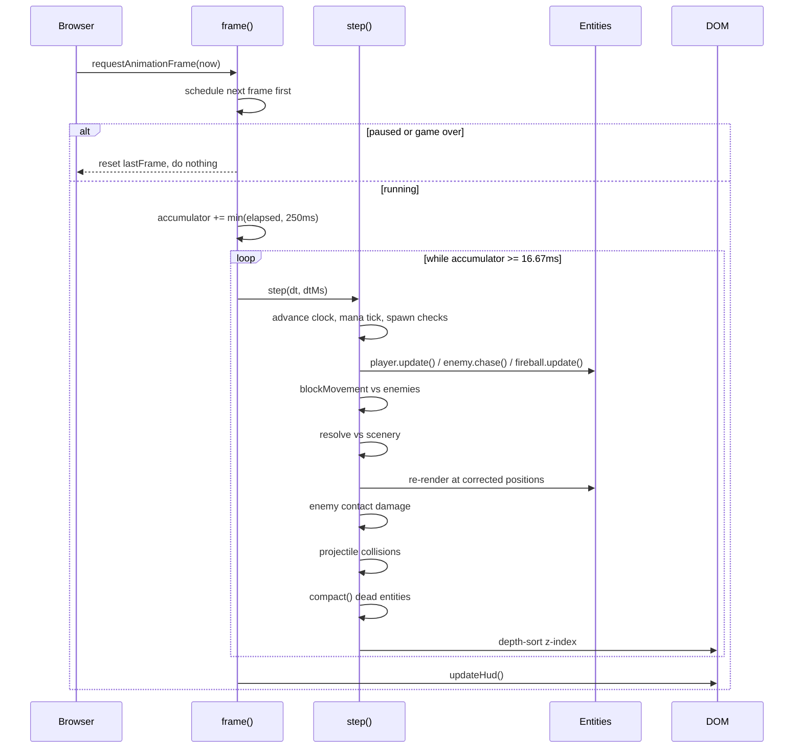
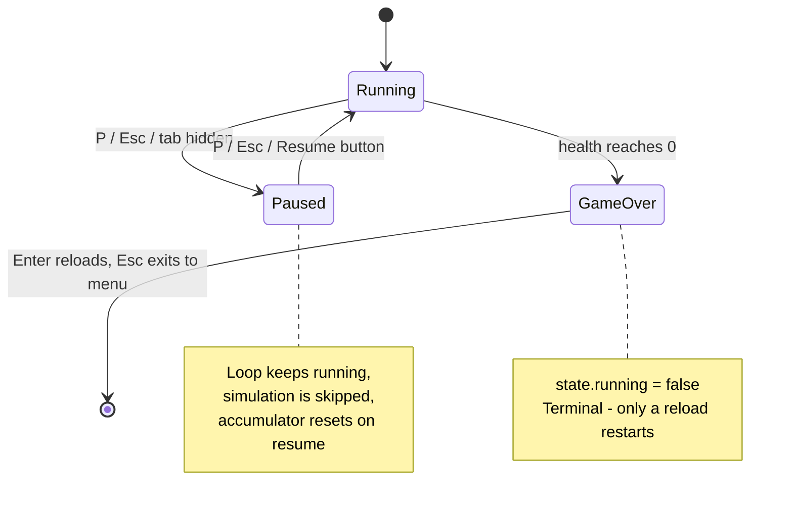

# Architecture

How Dungeon Dweller is put together, and where to look when you want to change
something. Read [README.md](README.md) first if you have not run the game yet.

Statements marked **(inferred)** are conclusions drawn from reading the code, not
from documented intent. Everything else is directly observable behaviour.

---

## Table of Contents

- [The shape of the system](#the-shape-of-the-system)
- [The two pages](#the-two-pages)
- [The `DD` namespace](#the-dd-namespace)
- [Entity model](#entity-model)
- [The frame lifecycle](#the-frame-lifecycle)
- [Fixed timestep, and why](#fixed-timestep-and-why)
- [The collision model](#the-collision-model)
- [Rendering discipline](#rendering-discipline)
- [CSS as part of the runtime](#css-as-part-of-the-runtime)
- [Game state and overlays](#game-state-and-overlays)
- [Audio](#audio)
- [Key design decisions](#key-design-decisions)
- [Where do I look if I want to change X](#where-do-i-look-if-i-want-to-change-x)

---

## The shape of the system

There are three layers, and they are unusually thin:

1. **Markup** declares the DOM the game moves around — the arena, the player, the
   HUD, the overlay, and the `<audio>` elements that act as the sound bank.
2. **CSS** supplies the artwork *and* the physical dimensions of every entity, plus
   sprite selection and the walk-cycle animation.
3. **JavaScript** owns simulation only: positions, collision, damage, timers, input.

The unusual part is layer 2. In most games the code owns entity size and appearance.
Here, JavaScript never sets a sprite or a width — it measures what CSS produced and
flips attributes that CSS reacts to. Keep that division in mind; it explains most of
the code's structure.



---

## The two pages

`index.html` is the menu and lives at the repository root. `html/game.html` is the
game and lives one directory down. That difference is load-bearing:

| Page | Asset prefix | Scripts loaded |
|------|--------------|----------------|
| `index.html` | `./` | `src/index.js` |
| `html/game.html` | `../` | `src/elements.js`, then `src/script.js` |

Because `game.html` sits in `html/`, every path it reaches — stylesheets, images in
`game_styles.css`, the warm-up image list in `script.js`, and the "Exit" link back to
the menu — is written relative to `html/`. This is the single most common way to
break the game with a well-meaning edit.

Navigation between them is plain hyperlinks and `window.location`; there is no router
and no shared state. **A run exists only in memory: reloading or leaving the page
destroys it.** Restart is literally `window.location.reload()`.

---

## The `DD` namespace

`src/elements.js` and `src/script.js` are classic scripts, not ES modules. They are
loaded in order by `<script>` tags and share exactly one global:

```js
const DD = (() => {
    /* ... */
    return {
        CONFIG, ENEMY_VARIANTS,
        clamp, overlaps, resolve,
        Sfx, Entity, Player, Enemy, FieldObject, Fireball,
    };
})();
```

`script.js` destructures what it needs from `DD` at the top and never reaches into
anything else. Everything private to the entity library stays inside the IIFE —
`sizeCache`, `FIREBALL_ROTATION`, and the internal helpers are not reachable from
outside. That is the whole module system: one global, one explicit export list.

**(inferred)** Modules were avoided so the game runs from `file://` and from any
static host without a build step or a server that sets JavaScript MIME types.

---

## Entity model

Everything on the field is a `<div>` positioned by a CSS transform, backed by a class
extending `Entity`.



Three things to internalise:

**Sizes come from CSS, measured once.** Each subclass creates its element, appends it,
then reads `getBoundingClientRect()`. Because that forces a layout flush, the result
is cached in a private `sizeCache` keyed by class name — the second skeleton of a run
costs no measurement. A new entity type therefore needs its `height`/`width` in
`game_styles.css` *before* the JavaScript will behave correctly.

**One `Enemy` class, two variants.** `ENEMY_VARIANTS` maps a variant name to its
class names, stats and rewards. The skeleton and the brute differ only by that table
entry. Adding a third enemy is a table entry plus CSS — not a new class.

**`alive` is the death protocol.** Nothing is spliced out of an array mid-iteration.
Entities set `alive = false`, and `compact()` sweeps each list once per frame. This is
why a fireball can be marked dead the instant it hits and still be safely iterated
over for the rest of the step.

---

## The frame lifecycle

`requestAnimationFrame` drives `frame()`, which accumulates real elapsed time and
runs as many fixed 16.67 ms simulation steps as that time affords.



The ordering inside `step()` is deliberate:

1. **Clock and timed events.** Mana regen, skeleton spawns and brute spawns are all
   driven off `state.elapsed`, which only advances inside `step()`. Nothing uses
   `setInterval`, so pausing genuinely pauses the world instead of letting timers run
   on in the background.
2. **Movement.** The player's pre-move position is captured first, because collision
   resolution needs it.
3. **Collision correction**, enemies then scenery.
4. **Render**, once, after positions are final — otherwise sprites would show the
   pre-correction position and jitter against walls.
5. **Damage**, then **projectiles**, then the **dead sweep**, then **depth sorting**.

`updateHud()` runs once per *frame*, not once per step — HUD numbers do not need to
be recomputed several times inside a single paint.

---

## Fixed timestep, and why

`frame()` does three defensive things worth understanding:

- **It schedules the next frame before doing any work**, so a thrown exception in one
  step does not silently stop the loop forever.
- **It clamps elapsed time to 250 ms.** Return to a backgrounded tab after a minute
  and the naive accumulator would owe ~3,600 steps and fast-forward the run — or
  freeze while it catches up. The clamp caps the debt at 15 steps.
- **It resets the accumulator on unpause**, so the pause duration is not banked and
  replayed the moment you resume.

Because the step is fixed, `dt` is always the same value. Physics is identical on a
60 Hz laptop and a 144 Hz monitor — the fast monitor simply paints the same simulation
more often.

---

## The collision model

There are **three** collision routines with deliberately different semantics. Using
the wrong one reintroduces bugs this design exists to prevent.

| Routine | Where | Mutates | Used for |
|---------|-------|---------|----------|
| `overlaps(a, b)` | `elements.js` | Nothing | All hit detection: spear box, fireball impact, enemy contact reach |
| `resolve(a, b)` | `elements.js` | Moves `a` | Scenery blocking — pushes `a` clear of `b` along the axis of least penetration |
| `blockMovement(entity, blocker, prevX, prevY)` | `script.js` | Moves `entity` | Body-to-body blocking between the player and enemies |

The distinction that matters: **hit detection must never move anything.** When
`Enemy.strike()` tests contact it uses `overlaps` on an inflated box; if it used
`resolve`, landing a hit would shove the attacker, and the player would be pushed
around the arena — including into lava — by enemies simply touching them.

`blockMovement` is the subtlest piece in the codebase. It differs from `resolve` in
two ways:

- **It is one-sided.** The blocker never moves. An enemy walking into a standing
  player leaves the player exactly where they were.
- **It only undoes movement that *increases* penetration**, axis by axis. This is
  because a chasing enemy closes the final pixels itself, so the player routinely
  begins a step already overlapping. Reverting unconditionally would pin them in
  place with no escape; permitting any motion that reduces overlap guarantees a way
  out on both axes, and resolving one axis at a time makes the player slide along a
  body instead of sticking to it.

`Enemy.chase()` also refuses to close the last pixel: once it overlaps the player it
stops advancing. **(inferred)** Combined with the above, this is what makes contact
feel like two solid bodies rather than a shoving match.

One asymmetry to be aware of: `CONFIG.contactReach` (6 px) inflates the enemy's
hitbox for damage. Collision separation leaves bodies exactly touching, which a strict
overlap test reads as *apart* — without the inflation, enemies pressed against you
would never land a hit.

---

## Rendering discipline

The game moves dozens of DOM nodes every frame and stays smooth by following two
rules everywhere:

**Composite, never lay out.** Position is always `transform: translate3d(x, y, 0)`.
Nothing writes `top` or `left`, which would force layout on every entity every frame.
Coordinates are rounded so pixel art stays crisp.

**Never write to the DOM twice with the same value.** Every write is guarded by a
cached previous value: `_transform`, `_facing`, `_barWidth` and `_layer` on entities,
and a `lastHud` record for the HUD. A stationary enemy costs zero style writes; a
health bar only touches the DOM when its rounded percentage actually changes.

`depthSort()` deserves a note. Sprites are tall, so an entity lower on the screen
should overlap one behind it. Rather than sorting the array, each entity derives a
`z-index` from its bottom edge — bucketed by 8 pixels (`>> 3`) so that walking around
produces a handful of style writes per second instead of one per frame.

---

## CSS as part of the runtime

`styles/game_styles.css` is not decoration; it holds state the simulation depends on.

- **Dimensions.** `.enemy` is 120x70, `.enemySpecial` 220x140, `#player` 100x50. The
  JavaScript learns these by measuring, so the stylesheet is the source of truth for
  how big a hitbox is.
- **Facing.** `Entity.setFacing()` writes `data-facing="left"`; selectors like
  `.icon[data-facing="left"]` pick the sprite. JavaScript never touches
  `background-image`.
- **Walking.** `Player.update()` toggles a `.walking` class; CSS runs a nine-frame
  `step-end` keyframe animation. The walk cycle is entirely CSS-driven — there is no
  frame counter in the JavaScript.
- **The explosion.** A CSS animation overrides the inline transform, so the blast
  would snap to the arena's top-left corner mid-animation. `Fireball.explode()` writes
  the impact point into `--ex`/`--ey` custom properties, and the keyframes carry the
  translation through. This is the one place where JS and CSS are tightly coupled by
  necessity.

Because sprites are painted by keyframes, the browser only fetches each walk frame the
first time it is displayed — visible as stutter on the first few steps. A `load`
handler at the bottom of `script.js` pre-fetches all 36 walk frames plus several
sprites into the cache. **A new animation direction must be added to that list.**

---

## Game state and overlays

State lives in one `state` object plus the player's own fields. There is no state
machine class; the three states are expressed by two booleans.



`showOverlay(title, stats, actions, variant)` is the single presentation path for both
the pause card and the game-over card. It builds rows and buttons from data, sets a
`data-variant` attribute for CSS to colour, and focuses the first button. Everything
is constructed with `document.createElement` and `textContent` — no `innerHTML`
anywhere in the codebase, so score and stat values cannot inject markup.

Input handling has one detail worth knowing: `facingStack` is a stack of currently
held directions, so the most recently pressed key wins. Holding left, then also
pressing up, faces you up; releasing up returns you to facing left. A plain "last key
down" variable would leave you facing a direction you are no longer holding.

`releaseAll()` clears held keys on blur, pause and death — otherwise a key held while
alt-tabbing stays logically down forever and your character runs off unattended.

---

## Audio

`Sfx` is a small registry: `register(name, selector)` stores a reference to an
`<audio>` element declared in the HTML, and `play`/`loop`/`stop` operate by name.
`play()` rewinds to zero first so rapid repeats retrigger.

Every playback call swallows the returned promise's rejection. Browsers refuse
autoplay until the user has interacted with the page, so those rejections are the
expected path, not an error — `unlockAudio()` starts the music on the first keypress
and hides the on-screen hint at the same time.

`Sfx.muted` is honoured by `play()` and `loop()`, but nothing in the UI currently sets
it — the flag exists without a control to toggle it.

---

## Key design decisions

| Decision | Rationale |
|---|---|
| DOM elements instead of `<canvas>` | Sprites are inspectable in devtools and styled in CSS; the compositor handles movement. **(inferred)** — the code never explains the choice, but the transform/attribute discipline throughout only pays off in a DOM renderer. |
| One `DD` global instead of ES modules | Runs with no build step and no module-aware server. **(inferred)** |
| Fixed timestep with accumulator | Frame-rate independence and immunity to tab-out fast-forward. Stated in the file header. |
| Split `overlaps` / `resolve` / `blockMovement` | Keeps hit detection side-effect free so attacking cannot displace bodies. Stated in comments. |
| All tuning in `CONFIG` / `ENEMY_VARIANTS` | Balance changes touch one screen of code rather than the loop. |
| Scenery positions as functions of arena size | A resize re-lays out the field instead of reloading and destroying the run. Stated in comments. |
| `alive` flag plus `compact()` | Safe removal while lists are being iterated. |
| Cached DOM writes everywhere | Avoids redundant style invalidation; the dominant per-frame cost in a DOM-rendered game. |

---

## Where do I look if I want to change X

| I want to… | Go to |
|---|---|
| Rebalance speed, damage, cooldowns, mana costs | `CONFIG` at the top of [`src/elements.js`](src/elements.js) |
| Change enemy stats, rewards or score values | `ENEMY_VARIANTS` in [`src/elements.js`](src/elements.js) |
| Add a new enemy type | `ENEMY_VARIANTS` entry + matching `.className` / `.iconClass` / `.barClass` rules in `game_styles.css`, then spawn it from `spawnEnemy()` |
| Change how often enemies appear | `CONFIG.spawn` in `elements.js`; the spawn block inside `step()` in `script.js` |
| Change spear reach or hit shape | `CONFIG.player.meleeReach` and `Player.meleeBox()` |
| Change the spear's on-screen pose | `SPEAR_POSE` in [`src/script.js`](src/script.js) (its 70x90 must match `.spear` in CSS) |
| Alter fireball behaviour | `Fireball` class and `CONFIG.fireball` |
| Rearrange rocks and lava | `FIELD_LAYOUT` in `script.js` — entries are functions of arena width/height |
| Add a new scenery type | `FieldObject` constructor (note the lake wrapper special case) + CSS class with explicit size |
| Rebind or add keys | `KEYMAP` and `onKeyDown` in `script.js` |
| Change the HUD | `#hud` markup in `html/game.html`, the `hud` element map and `updateHud()` in `script.js`, `.hud-*` rules in CSS |
| Change the pause or game-over card | `showOverlay()` / `endGame()` in `script.js`, `#overlay*` rules in CSS |
| Change a sprite | The relevant `background-image` in `game_styles.css` — not the JavaScript |
| Add or replace a sound | Add an `<audio>` element to the page, register it via `Sfx.register()`, call `Sfx.play()` |
| Add a walk animation direction | Keyframes in `game_styles.css`, plus the warm-up list at the bottom of `script.js` |
| Change the menu | [`src/index.js`](src/index.js), `index.html`, `styles/index_styles.css` |
| Adjust sprite layering | `depthSort()` in `script.js` |
